# Odločitveni sistemi - seminarska naloga

Seminarska naloga izdelana pri predmetu Odločitveni sistemi. 
Celotna seminarska naloga je implementirana v python programskem jeziku.

Kazalo vsebine
===============

* Podatki ter branje podatkov
* Prediktorji in priporočila
* Napovedovanje ocen s podobnostjo med produkti (Item based predictor)
* Priporočilo zase
* Napovedovanje z metodo Slope one
* Evalvacija priporočilnega sistema
* Dobljeni rezultati

## Podatki ter branje podatkov

V seminarski nalogi so uporabljeni izvedeni Movie Lens podatki.

##### Struktura podatkov:
     - 2113 users
     - 10197 movies
   
     - 20 movie genres
     - 20809 movie genre assignments
     - avg. 2.040 genres per movie

     - 4060 directors
     - 95321 actors
     - avg. 22.778 actors per movie
     - 72 countries

     - 10197 country assignments
     - avg. 1.000 countries per movie
     - 47899 location assignments
     - avg. 5.350 locations per movie

     - 13222 tags
     - 47957 tag assignments (tas), i.e. tuples [user, tag, movie]
     - avg. 22.696 tas per user
     - avg. 8.117 tas per movie

     - 855598 ratings
     - avg. 404.921 ratings per user
     - avg. 84.637 ratings per movie

Za branje podatkov iz datotek, se v seminarski nalogi uporablja knjižnjica pandas. 
Pri manipulaciji s podatki pa je poleg knjižnjice pandas, uporabljena še knjižnjica numpy.

## Prediktorji in priporočila

V seminarski nalogi implementirana priporočila s sledečimi prediktorji:
* Priporočanje z naključnim prediktorjem
* Priporočanje s povprečnim prediktorjem
* Priporočanje najbolj gledanih filmov
* Napovedovanje ocen s podobnostjo med produkti (Item based predictor)
* Najbolj podobni filmi
* Priporočanje glede na trenutno ogledano vsebino
* Priporočilo zase
* Napovedovanje z metodo Slope one

## Napovedovanje ocen s podobnostjo med produkti

Razred na podlagi podobnosti med produkti izračuna pričakovano oceno produktov za izbranega uporabnika. 
Podobnost se izračuna s popravljeno kosinusno razdaljo. Napovedi se izračuna z sledečimi formulami.

    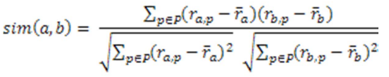
    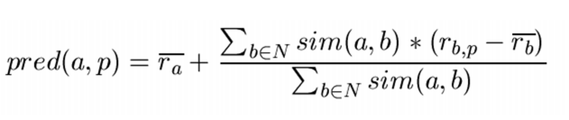

## Napovedovanje z metodo Slope one

Pri napovedovanju z metodo Slope one, sem uporabil sledeče formule.

    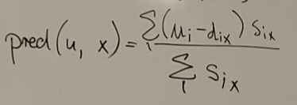

## Evalvacija priporočilnega sistema

Pri evalvaciji priporočilnega sistema smo želeli preveriti natančnost prejetih rezultatov.
To smo izračunali z merami MAE, RMSE, priklic, natančnost, F1.

    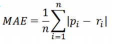
    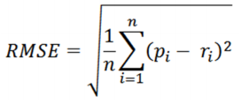
    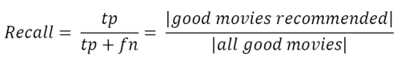
    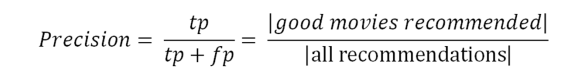
    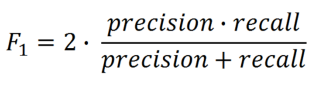

## Dobljeni rezultati

    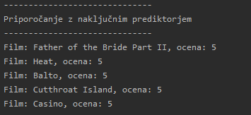
    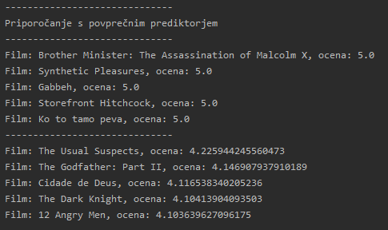
    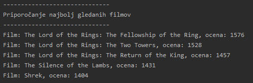
    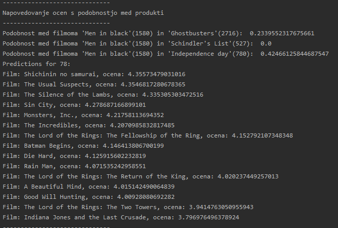
    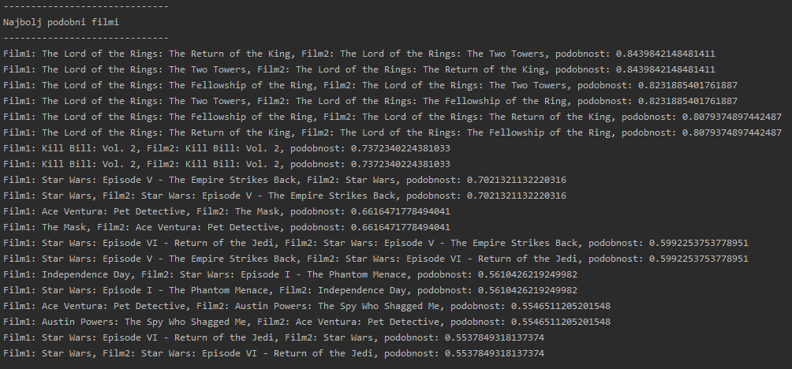
    
    
    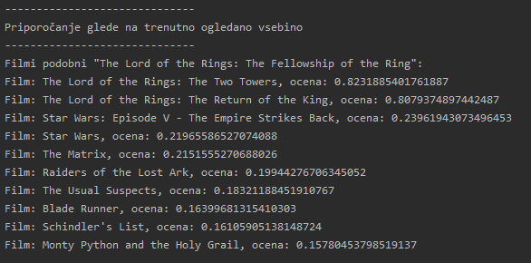
    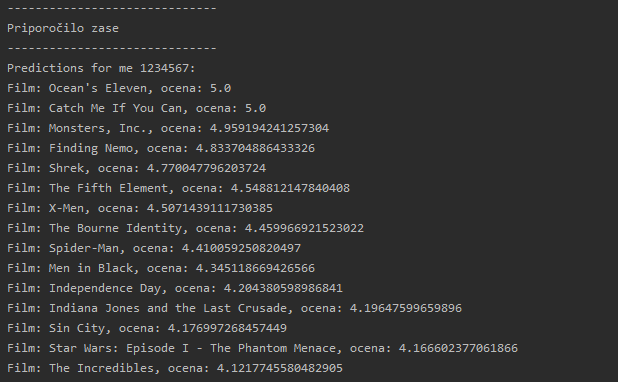
    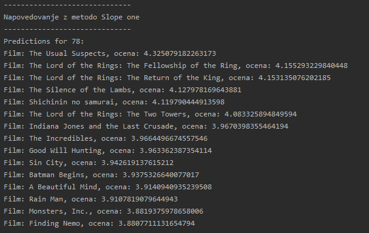
    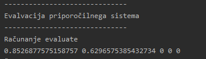

